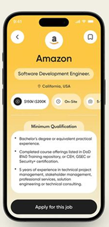
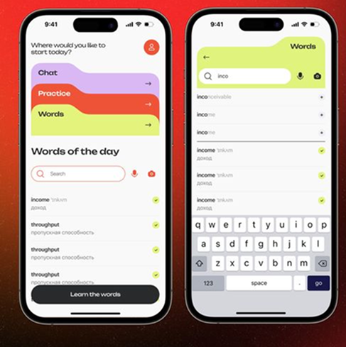

# 온보딩 플로우 재정의 — 입장→취향파악→추천→전시 온보딩 (2026-07-13)

> 상태: **초안(사용자 구술 캡처)**. 아직 미구현. 이 문서는 사용자가 그린 지향 플로우를
> 그대로 담는다. 구현/설계 세부는 후속.

## 사용자 원문 (verbatim)

> 플로우가 맨처음에 들어올 때 언어를 선택하게 하고 우리 서비스 및 로미에 대해서
> 소개하면서 입장을 시키는거야. 그래서 박람회나 전시에 대한 사용자의 맥락을 파악하는
> 질문들을 하고 이걸 토대로 사용자의 전시 관람 취향을 파악하는 거잖아? 뒷배경에선 이제
> 이 사람이 기존에도 박람회를 잘 다녔는지 아닌지, 또는 이런 전시에 원래부터 관심이
> 있었는지 없었는지 보통 다니면 어떤 걸 위주로 보는지 평소에 무엇에 관심이 많은지 등에
> 대해서 사용자를 파악하게 되고 이걸 토대로 사용자의 취향을 파악해봤어요 라고 하면서
> 이제 취향 지도가 그려지게 되겠지? 그러면 그 다음은 전시목록이 뜨게 될텐데 여기서는
> 로미의 추천이 제대로 들어가줘야해. 이런이런 취향을 갖고있는 너가 관심있을 전시로
> 우선 배치해봤어. 라는 식으로 배치를 해놓고 그 다음에 사용자가 해당 전시를 누르면
> 이 전시는 어떤 전시인지를 소개하면서 이 전시에 대해서 너가 어떤거에 관심있을 지
> 분석해보는 식으로 바로 온보딩이 들어가줘야해.
> 여기 온보딩은 사전 언어선택 이후의 로그인과는 전혀 다른 방식의 접근이 필요해
> 하단 플로팅으로 로미가 떠있고 상단에는 검색창과 아래에는 각종 피드가 있게 되고
> 이 피드들은 사전 온보딩을 통해 로미가 추천순으로 구성해놓은 피드들이고 
> 기존에 이 전시를 어떤 마음으로 왔는지, 보통 부스를 고를 때 뭐 부터 보는지, 오래 머물게 되는 부스는 무슨 형태인지
> 오늘 전시를 다 보고나서 남기고 싶은 건 어떤건지, 그리고 검색창과 피드와 함께 로미가 계속 같이 찾아나가는 형태인거지
> 그래서 사용자가 피드에서 부스별로 끌림, 나중에, 별로, 이미 봄을 누르거나 피드를 스크롤하거나 하는 방식일 텐데
> 이걸 로미가 계속 추적하면서 사용자를 이해하는 형태로 가는거야. 실제로는 사용자의 반응에 따라 로미가 계속 말이 달라져야겠지?
> 뭐 어떤 부스에 대해서 끌림을 눌렀으면 아 너는 이런 부스를 좋아하는구나? 라던가 검색창에 특정 부스를 검색한다면
> 그걸 바로 로미가 기억에 저장해놓고 이런 부스에 관심이 있다는 것을 인지를 하고 있어야하는거지.
> 그리고 나서 사용자가 직접 온보딩을 어느정도 완료한거 같다면 하단 플로팅바에 있는 로미가 질문을 하는거지 너가 관심있는 부스에 대해 어느정도 이해했어라던가 너의 취향을 어느정도 파악했어라던가
> 이거는 상단 우측이나 하단 플로팅에 로미가 %로 계속 나타내는거야 기존 온보딩에는 스테이터스바로 진행상태를 알려줬다면 여기서는 로미가 스스로 인지하고 %로 어느정도 취향을 파악했다라는걸 보여주고 
> 100%가 되면은 온보딩을 마무리하고 이제 실제 우리가 만들어놨던 전시 홈으로 들어와서 사용자가 선택했던 피드리스트와 로미가 또 추천하는 사용자 맞춤형 피드 6가지를 보여주는거지.
> 지금 여기 홈에서 고쳐야할 게 현재 상단에 로미가 ~취향을 토대로 추천해봤어 라고 하는데 이게 홈 상단에 있으면 안되고 하단 플로팅으로 떠있는 로미가 말로 해줘야하는 부분인거고 휘발성이라는 이야기임
> 그리고 온보딩을 이미 마쳤으니까 추가 온보딩을 하는 버튼이 필요없고 그냥 홈에는 전시 정보, 지도로 가는거, 아래는 피드 리스트가 있고 하단 플로팅에는 이때 쯤 되서야 사용자의 맥락을 이해한 수준이 된거니까 
> 골라둔 곳은 마음에 들어? 라던가 등의 다양한 이야기들을 계속 말을 바꾸면서 로미가 해줘야하는 거임
> 일단 여기까지가 이 사용자를 파악하는 전체적인 UX야.

## 구조화한 플로우 (단계)

1. **언어 선택** — 최초 진입 시 먼저 언어를 고르게 한다.
2. **서비스 + 로미 소개하며 입장** — 냅다 질문이 아니라, Roam이 뭔지·로미가 누군지
   소개하면서 자연스럽게 입장시킨다.
3. **맥락 파악 질문(앱 레벨 온보딩)** — 박람회/전시에 대한 사용자 맥락을 묻는다.
   뒷배경에서 파악하려는 것:
   - 기존에도 박람회를 잘 다녔는지 (경험 유무)
   - 이런 전시에 원래부터 관심이 있었는지 (관심 유무)
   - 보통 다니면 어떤 걸 위주로 보는지 (관람 성향)
   - 평소에 무엇에 관심이 많은지 (일반 관심사)
4. **취향 파악 완료 → 취향 지도** — "당신의 취향을 파악해봤어요" 식으로 마무리하며
   **취향 지도**가 그려진다(사용자 모델 시각화).
5. **전시 목록 = 로미의 진짜 추천** — 목록이 뜨면 로미 추천이 제대로 반영돼야 한다.
   "이런이런 취향을 갖고 있는 너가 관심 있을 전시로 우선 배치해봤어" 식으로 취향 기반
   정렬/강조.
6. **전시 선택 → 전시 소개 + 전시별 온보딩 진입** — 사용자가 전시를 누르면, 그 전시가
   어떤 전시인지 소개하면서 "이 전시에서 너는 어떤 걸 관심 있어 할지" 분석하는 흐름으로
   **바로 전시별 온보딩**으로 들어간다.
   - ⚠️ 이 전시 온보딩은 **사전(언어선택→로그인) 온보딩과 전혀 다른 패러다임**이다.
     고정 질문/스텝/폼이 아니라 **컴패니언 주도 탐색**이다.
7. **전시 온보딩 = 탐색형 화면(폼 아님)** — 레이아웃:
   - **하단 플로팅에 로미**가 상주.
   - **상단에 검색창**, **아래에 각종 피드**.
   - 이 피드들은 **사전 앱 온보딩을 통해 로미가 추천순으로 미리 구성**한 것.
   - 파악하려는 것(질문 축): 이 전시를 어떤 마음으로 왔는지 · 보통 부스 고를 때 뭐부터
     보는지 · 오래 머물게 되는 부스는 무슨 형태인지 · 다 보고 나서 남기고 싶은 건
     무엇인지. → 검색창 + 피드 + 로미가 **함께 계속 찾아나가는 형태**.
8. **반응 추적 = 사용자 이해** — 신호원:
   - 피드에서 부스별 **끌림 / 나중에 / 별로 / 이미 봄** 누르기.
   - 피드 **스크롤**.
   - 검색창에 **특정 부스 검색**.
   - 로미가 이 전부를 추적하며 사용자를 이해한다. **반응에 따라 로미 말이 계속 달라진다.**
     - 끌림 → "아 너는 이런 부스를 좋아하는구나?"
     - 특정 부스 검색 → 그 부스를 **바로 기억에 저장**, "이런 부스에 관심 있다"고 인지.
9. **진행률 = 로미가 %로 스스로 인지** — 기존 온보딩은 스테이터스바로 진행을 알렸지만,
   여기서는 **로미가 스스로 "취향을 어느 정도 파악했다"를 %로** 표시(상단 우측 또는 하단
   플로팅). 어느 정도 되면 로미가 먼저 묻는다 — "관심 부스 어느 정도 이해했어" /
   "네 취향 어느 정도 파악했어".
10. **100% → 온보딩 마무리 → 실제 전시 홈 진입** — 우리가 만들어 둔 전시 홈으로 들어와,
    **사용자가 고른 피드 리스트 + 로미 추천 맞춤형 피드 6가지**를 보여준다.
11. **전시 홈에서 고칠 것** —
    - 현재 상단의 "~취향을 토대로 추천해봤어" 배너는 **상단 고정이면 안 됨** → **하단
      플로팅 로미가 말로** 해주는 부분(= **휘발성**).
    - 온보딩을 이미 마쳤으니 **추가 온보딩 버튼 불필요**(제거).
    - 홈 구성 = 전시 정보 · 지도로 가기 · 아래 피드 리스트 · 하단 플로팅 로미.
    - 이때쯤이면 로미가 사용자 맥락을 이해한 수준 → "골라둔 곳은 마음에 들어?" 같은
      말을 **계속 바꿔 가며** 건넨다.

> 여기까지가 사용자를 파악하는 전체 UX.

## 함의 (메모)

- **두 온보딩은 다른 패러다임.**
  - 앱 레벨(언어→로미/서비스 소개→맥락 질문): 고정형 문답 → 취향 지도.
  - 전시 레벨: **컴패니언 주도 탐색형**. 폼/스텝/진행바 없음. 검색·피드·반응으로 로미가
    조용히 사용자를 좁혀 나간다.
- **진행 표현이 바뀐다.** 스테이터스바 → **로미의 % 자기 인지**. 즉, 결정론 confidence
  점수를 로미 언어로 표면화(“취향 X% 파악”). 100% = 온보딩 종료 임계.
- **반응이 곧 신호.** 끌림/나중에/별로/이미 봄 + 스크롤 + 검색 쿼리 전부를 기억으로
  적재하고 **즉시 로미 발화에 반영**(반응할 때마다 말이 달라짐).
- **온보딩 종료 = 전시 홈 승격.** 홈 피드 = 사용자가 고른 리스트 + 로미 추천 6.
- **홈 로미 발화는 휘발성 하단 플로팅.** 현재 코드의 상단 고정 배너
  (`feed.entryWithValues` 등)와 충돌 → 상단에서 걷어내고 플로팅 컴패니언 발화로 이동.
- **추가 온보딩 버튼 제거.** 현재 전시 홈의 ValueOnboarding 진입 카드는 이 모델에선
  불필요 → 재검토.
- 전체적으로 CLAUDE.md의 **에이전트 구조(Companion=언어 표면, 나머지 결정론)** 및
  **4계층 기억**과 정렬. %·반응 추적·기억 저장은 결정론, 로미 말만 LLM/템플릿 표면.

## 피드 문구 = 부스별로 달라야 함 (핵심 문제)

- **지금 문제**: 로미가 **모든 피드에 동일한 문구**를 내뱉는다. 부스가 다르고 내용이
  다른데 같은 말이면 안 된다.
- **가야 할 방향**: 각 피드 카드가 **그 부스의 구체 정보 일부**(무엇을 하는 곳인지,
  어떤 굿즈·프로그램이 있는지 등)를 실제로 끌어와서, **"그래서 너한테 추천"** 이라는
  식으로 부스마다 다른 근거를 붙인다.
- 즉 피드 문구 = 일반 템플릿 한 줄이 아니라 **부스 데이터(요약·굿즈·태그·근거) + 사용자
  취향 교집합**으로 조립된 **부스별 맞춤 근거**. (근거 카드/grounding 자산과 연결 —
  `src/lib/feed/grounding.ts`, `booth enrichment`의 recommendationReasons·valueTags·
  thingsToDo를 실제로 소진.)

## UI 레퍼런스 (참고 이미지)

> 아래 이미지는 사용자가 방향 참고용으로 가져온 것. 그대로 베끼는 게 아니라 **구조·정보
> 배치·톤**을 참고해서 만든다. 원본: `docs/decisions/assets/`.

### 1. 부스 근거 카드 — 로미가 대화하듯 이유를 달아주는 형태

- 본 것: 상단에 **엔티티 헤더**(이름 크게 · 한 줄 역할/설명) + **핵심 정보 pill들**
  (예: 급여/온사이트/경력 → Roam에선 **부스의 구체 정보 pill**: 분야·굿즈 유무·대기·
  체험 등) + 그 아래 **설명 카드**(불릿 요약) + 하단 **CTA**.
- 적용 의도: 로미가 **부스의 구체 정보 일부를 pill/요약으로 보여주면서 대화하듯 이유를
  달아준다.** "이 부스는 이런이런 내용 + 이런 굿즈가 있어서 너한테 추천" 형태. 피드
  문구 차별화(위 섹션)의 시각적 틀.

### 2. 부스 홈 + 온보딩 검색/피드 화면 (2단)

- **좌측 = 부스 홈 UI 참고**: 상단 인사("Where would you like to start today?" 자리 =
  로미 발화) + **큰 컬러 액션/카테고리 카드 스택**(예시: Chat/Practice/Words →
  Roam에선 전시 정보·지도·핵심 진입) + 섹션 헤딩 + **검색창** + **피드 리스트**(항목마다
  체크/상태 표시) + 하단 CTA.
- **우측 = 온보딩의 검색창 + 하단 피드 + 검색된 부스 화면**: 상단 **검색창**(입력 중
  쿼리) + **실시간 자동완성/제안 리스트** + **매칭된 부스 항목들**(우측에 상태 체크) +
  키보드. → 온보딩에서 사용자가 부스를 검색하면 이렇게 **바로 결과 부스가 뜨고**, 로미가
  그 검색을 기억에 저장(위 8단계 반응 추적).
- 적용 의도: 전시 온보딩 화면(4~7단계)의 **상단 검색창 + 하단 추천 피드** 레이아웃과,
  검색 시 결과 부스가 뜨는 상호작용의 시각적 참고.
